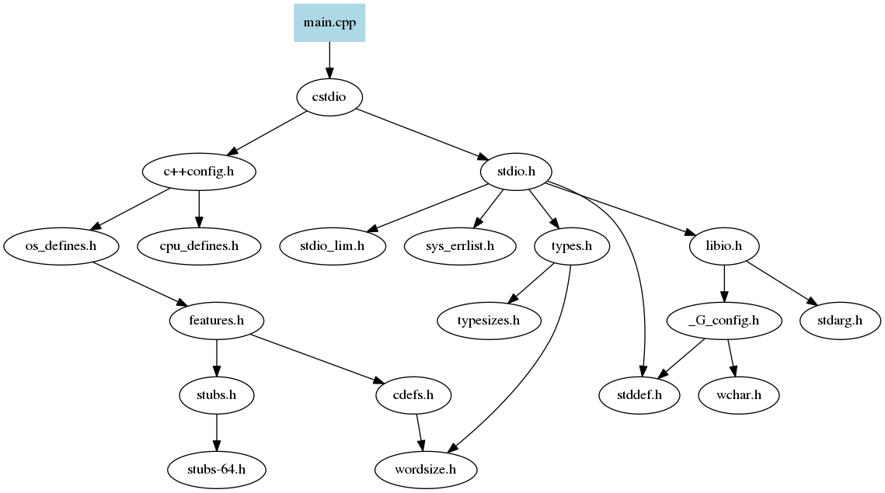
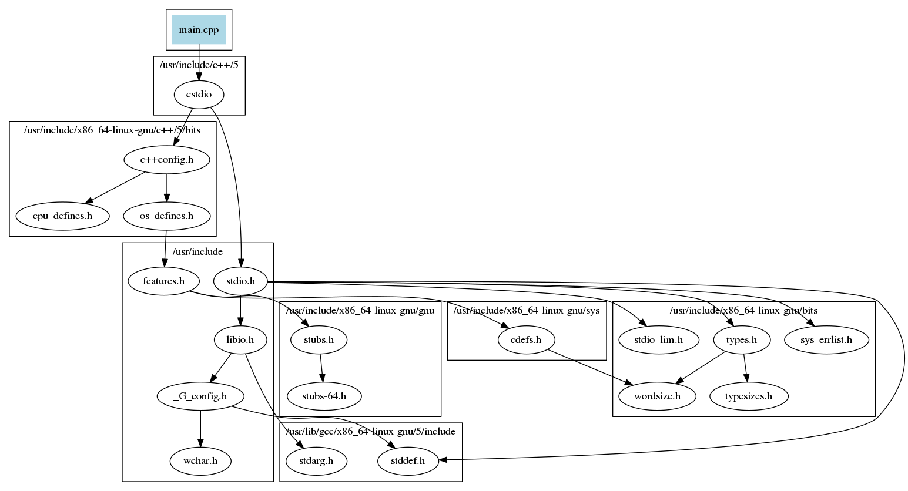
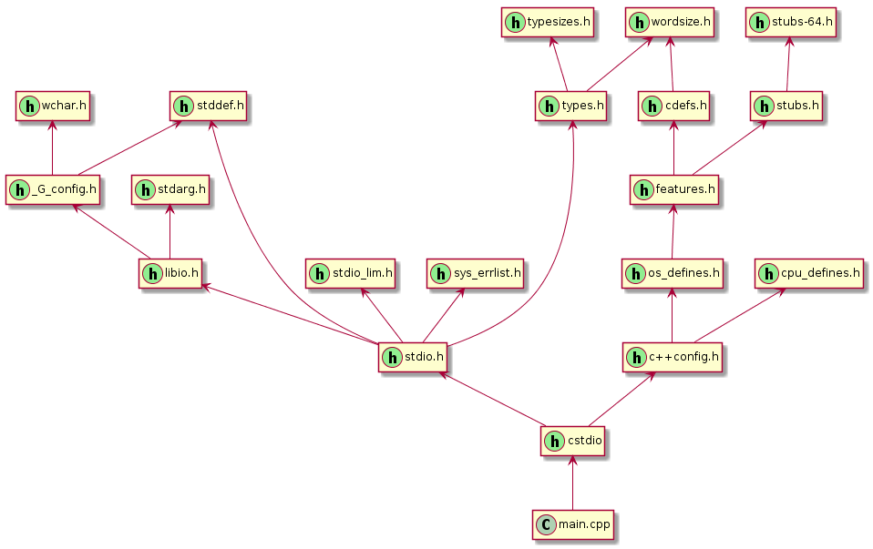
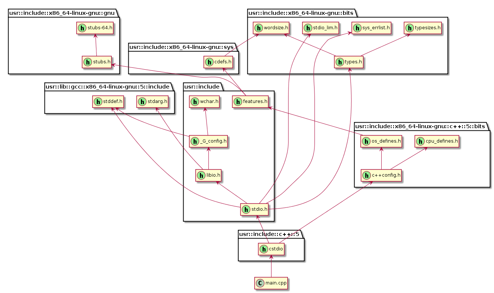

### Generate Include Dependency Diagram - gidd

##### Warning: This is currently a quick'n'dirty hack to view dependencies.

The gidd tool will look at c/c++ include file dependencies and generate [Graphviz](http://www.graphviz.org/) .dot files 
and [PlantUML](http://plantuml.com/) diagrams to visualize the dependency.
It uses the output from gcc/g++'s -H flag to understand the dependencies. 

#### Howto

To enable, add -H to gcc/g++. When using cmake, add this to your CMakeLists.txt:
```
set(CMAKE_C_FLAGS "${CMAKE_C_FLAGS} -H")
set(CMAKE_CXX_FLAGS "${CMAKE_CXX_FLAGS} -H")
```

All includes in a cmake project:
```
mkdir build && cd build
cmake .. && make clean && make -j1 &> input.txt
```

it is also possible to generate includes for one file in a project:
```
touch ../src/file.cpp
make -j1 &> input.txt
```

##### How to convert the dot file to svg
```
dot -Tsvg output.dot > doc/examples/output_dot.svg
dot -Tsvg output_no_clusters.dot > doc/examples/output_no_clusters_dot.svg
```

##### How to convert the dot files to png
```
dot -Tpng output.dot > doc/examples/output_dot.png
dot -Tpng output_no_clusters.dot > doc/examples/output_no_clusters_dot.png
```

##### How to convert the puml files to svg
```
plantuml -tsvg output.puml -o doc/examples
plantuml -tsvg output_no_clusters.puml -o doc/examples
```

##### How to convert the puml files to png
```
plantuml -tpng output.puml -o doc/examples
plantuml -tpng output_no_clusters.puml -o doc/examples
```


#### Filter include directories
If you are not interested in a set of include folders (normally the system or default),
you can add a filter.txt in the same folder as input.txt where you can filter out certain folders.
The easiest way of getting a list of include folders is to run gidd once and gidd will print all used folders.
Then you can copy/paste from that list into the filter.txt file and run gidd again.

#### Examples
Here is an example of how a tiny hello world example can look like:
```c++
#include <cstdio>

int main() {
    printf("Hello, World!\n");
}
```
output_no_clusters.dot:

output.dot:

output_no_clusters.puml:

output.puml:

